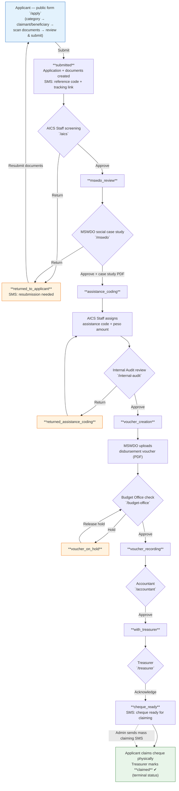
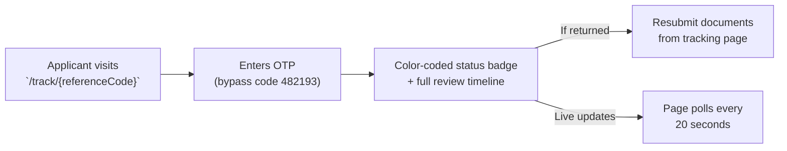

# ALALAY — IT Expert Testing Guide

**System URL:** https://web-production-939dc.up.railway.app

---

## Credentials

| Panel | Email | Dashboard Path |
|-------|-------|----------------|
| System Admin | `admin@gmail.com` | `/admin/dashboard` |
| AICS Staff | `aics@gmail.com` | `/aics/dashboard` |
| MSWDO Officer | `mswdo@gmail.com` | `/mswdo/dashboard` |
| Internal Auditor | `internalaudit@gmail.com` | `/internal-audit/dashboard` |
| Budget Officer | `budget@gmail.com` | `/budget-office/dashboard` |
| Accountant | `accountant@gmail.com` | `/accountant/dashboard` |
| Treasurer | `treasurer@gmail.com` | `/treasurer/dashboard` |

**Password for all accounts:** `Password14312.` *(including the trailing period)*

> Each account is redirected to its own role dashboard automatically after login. Accessing another role's path returns **403 Forbidden**.

---

## OTP Bypass (for testing)

**Bypass code: `482193`** — works on **both** OTP flows.

### 1. Login OTP (email code)

Every staff login requires an email OTP after password + captcha:

1. Enter email + password, pass the captcha, click **Log In**
2. At the OTP screen you will see an amber hint: *"OTP bypass active — use the code provided by the developer."*
3. Enter `482193` → you are signed in

*No email code needed — the real code is sent to the configured mailbox and is not required while the bypass is active.*

### 2. Public tracking OTP (SMS/email code)

Anyone tracking an application at `/track/{referenceCode}`:

1. Enter the reference code → **Track**
2. At the OTP screen (amber hint visible), enter `482193`
3. View the live status timeline

*Works even if no SMS/email OTP was ever dispatched for that reference.*

> **Notes**
> - A wrong 6-digit code is still rejected (bypass only accepts `482193`).
> - Rate limit: 10 attempts / 5 minutes applies even with the bypass.
> - The bypass is enabled via environment flag and will be **disabled after your evaluation**.

---

## Suggested Test Script

1. **Panel access** — log into each of the 7 panels with the credentials above (bypass `482193` at the OTP screen), confirm each dashboard loads and the AUP agreement prompt appears on first login.
2. **Submit an application** — as a public user, fill `/apply` (category → claimant/beneficiary info → document scan/upload → review & submit). Note the **reference code**.
3. **Track it** — open `/track/{referenceCode}`, bypass the OTP, confirm the status timeline shows `submitted`.
4. **Walk the pipeline** — advance the application through every stage using the matching panels (diagram below): AICS screening → MSWDO case study → assistance coding → Internal Audit → voucher creation → Budget check → Accountant → Treasurer → `cheque_ready` → `claimed`.
5. **Return branches** — at any review stage use **Return** instead of approve; confirm the applicant sees the returned status on the tracking page and can resubmit documents.
6. **Permissions** — log into a panel and confirm other roles' paths are blocked (403), and that audit trail entries appear in the admin panel.

---

## How an Application Travels Across the System

### Public tracking path (side view)

### Stage → Role cheat sheet

| # | Status | Actor | Action |
|---|--------|-------|--------|
| 1 | `submitted` | AICS Staff | Screen: approve → MSWDO, or return to applicant |
| 2 | `mswdo_review` | MSWDO | Social case study PDF |
| 3 | `assistance_coding` | AICS Staff | Assign financial code + amount |
| 4 | `internal_audit_review` | Internal Audit | Verify coding (return → re-code) |
| 5 | `voucher_creation` | MSWDO | Upload disbursement voucher |
| 6 | `budget_checking` | Budget Officer | Approve or hold voucher |
| 7 | `voucher_recording` | Accountant | Accounting verification |
| 8 | `with_treasurer` | Treasurer | Acknowledge → cheque ready |
| 9 | `cheque_ready` | Treasurer | Applicant claims → **claimed** |

Every status change writes an immutable **Review** record (audit trail) visible in the admin panel.
